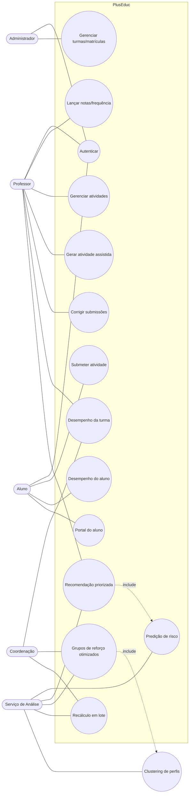

# Plano de Projeto — Fábrica de Software 2026.2

**Projeto integrador:** Fábrica de Software + Tópicos Avançados
**Produto:** PlusEduc — Plataforma de Gestão Pedagógica com Análise de Aprendizagem
**Equipe:** _(preencher com os 3 a 5 integrantes)_
**Curso:** Ciência da Computação — UNINASSAU
**Data-base:** 03/09/2026 · **Entrega final:** 05/12/2026

> Documento elaborado a partir do roteiro da Aula 01 da disciplina. O projeto é
> um **único sistema** no qual os conhecimentos de Fábrica de Software
> (produto completo: interface, backend, banco, regras de negócio, controle de
> usuários) e de Tópicos Avançados (IA, otimização e processamento de alto
> desempenho) estão **integrados de forma real**, e não apenas estética.

---

## 1. Escolha do tema

**Área:** Educação — gestão pedagógica da educação básica (Ensino Fundamental e
Ensino Médio), com currículo alinhado à BNCC.

**Contexto:** escolas e redes de ensino que precisam acompanhar turmas, notas,
frequência, atividades e, principalmente, **identificar e tratar lacunas de
aprendizagem** de cada aluno ao longo do ano letivo. O sistema atende ao
professor (gestão e correção), à coordenação pedagógica (visão da turma e da
escola), ao aluno e aos responsáveis (portal de acompanhamento).

O tema se encaixa no exemplo "Sistema Acadêmico" citado em aula: gerencia
alunos, turmas, notas, frequência e relatórios — acrescido de um **núcleo
computacional próprio** de análise e recomendação, que constitui a integração
com Tópicos Avançados.

---

## 2. Definição do problema

### Qual problema a equipe pretende resolver?

O acompanhamento pedagógico individualizado na educação básica é feito, na
prática, de forma manual e reativa:

- O professor lança notas e frequência em planilhas ou sistemas que **apenas
  registram** dados, sem transformá-los em orientação de ação.
- **Lacunas de aprendizagem** (habilidades da BNCC não consolidadas) só são
  percebidas tarde, geralmente após a reprovação em uma avaliação.
- Não há priorização objetiva: com 30 a 40 alunos por turma, o professor não
  consegue dizer **quem precisa de reforço primeiro** e **em qual conteúdo**.
- A montagem de grupos e horários de reforço é empírica e frequentemente gera
  conflito de agenda ou grupos desbalanceados.
- Recalcular indicadores de desempenho de toda a escola (médias, tendências,
  risco) é lento quando feito aluno a aluno.

### Por que esse problema é relevante?

- **Impacto social:** a defasagem de aprendizagem na educação básica é um
  problema estrutural no Brasil; agir a tempo depende de informação organizada.
- **Impacto para o usuário:** devolve tempo ao professor e à coordenação,
  substituindo trabalho manual de compilação por leitura de indicadores prontos.
- **Aderência técnica:** o problema tem uma dimensão de dados (histórico de
  notas, frequência, submissões, habilidades BNCC) que justifica **modelos
  preditivos, agrupamento, otimização e processamento em lote de alto
  desempenho** — exatamente o componente exigido por Tópicos Avançados, aqui
  ligado ao problema central e não "colado" ao sistema.

---

## 3. Objetivos do sistema

### Objetivo geral

Disponibilizar uma plataforma web completa que centralize a gestão pedagógica de
turmas da educação básica e que **analise automaticamente o desempenho de cada
aluno** para recomendar, de forma explicável e priorizada, intervenções de
reforço nas habilidades da BNCC.

### Principais resultados que a solução pretende alcançar

1. **Gestão unificada** de alunos, professores, turmas, currículo por série,
   notas, frequência, atividades e submissões, com controle de acesso por perfil.
2. **Diagnóstico de aprendizagem** por aluno e por turma: médias por componente
   curricular, frequência, evolução no tempo e lacunas de habilidades.
3. **Predição de risco acadêmico** por aluno/componente, com antecedência
   suficiente para intervenção pedagógica.
4. **Recomendação pedagógica priorizada e explicável** — qual conteúdo, para
   quem, em que ordem e por quê.
5. **Formação otimizada de grupos de reforço** (perfil de dificuldade + agenda),
   minimizando conflitos e desbalanceamento.
6. **Recálculo em lote de indicadores de toda a escola** com desempenho medível
   (uso de processamento vetorizado/paralelo, com _speedup_ documentado).
7. **Portal do aluno/responsável** com atividades, notas, frequência e pontos a
   melhorar.
8. **Entregáveis de qualidade profissional**: código versionado no GitHub,
   documentação técnica, banco com instruções de execução e os dois vídeos.

---

## 4. Público-alvo

| Perfil | Como utiliza / é beneficiado |
|---|---|
| **Professor** | Gerencia turmas, cria e corrige atividades (objetivas automáticas e discursivas manuais), lança notas e frequência, consulta desempenho e recebe recomendações de reforço por aluno. |
| **Coordenação pedagógica** | Visão agregada da turma e da escola, indicadores de risco, grupos de reforço sugeridos, relatórios. |
| **Aluno** | Portal com atividades disponíveis, notas, frequência, turma, professores e pontos fortes/fracos. |
| **Responsáveis** | Acompanham, pelo portal do aluno, desempenho e aspectos que precisam de melhoria. |
| **Administrador/Secretaria** | Cadastros base (usuários, turmas, matrículas, catálogo de componentes por série). |

Segmento: escolas de educação básica (redes públicas ou privadas) que seguem a
BNCC. Uso previsto: dezenas de turmas e centenas a poucos milhares de alunos por
instância.

---

## 5. Requisitos Funcionais

### Autenticação e controle de acesso
- **RF01** — Login com e-mail e senha, emissão de token JWT e _refresh token_.
- **RF02** — Perfis de acesso distintos (ADMIN, PROFESSOR, ALUNO) com
  autorização por endpoint e por tela.
- **RF03** — Edição de perfil e troca de senha pelo próprio usuário.
- **RF04** — Cadastro público de professores com aprovação/ativação.

### Cadastros e currículo
- **RF05** — CRUD de alunos, professores e turmas.
- **RF06** — Matrícula e remanejamento de alunos em turmas.
- **RF07** — Catálogo de componentes curriculares por etapa/série, alinhado à
  BNCC; uma turma exibe apenas os componentes compatíveis com a série.
- **RF08** — Atribuição de, no máximo, um professor por componente em cada turma.
- **RF09** — Registro de habilidades/lacunas de aprendizagem por aluno
  (componente, tópico, severidade, status de melhoria).

### Notas, frequência e atividades
- **RF10** — Lançamento e consulta de notas por aluno e por turma; cálculo de
  média individual e por componente.
- **RF11** — Registro e consulta de frequência.
- **RF12** — CRUD de atividades (objetivas e discursivas), com enunciado,
  questões e gabarito.
- **RF13** — Geração assistida de atividades a partir de um tópico
  (serviço de apoio textual, com _fallback_ determinístico quando o provedor
  externo estiver indisponível).
- **RF14** — Submissão de atividades pelo aluno no portal.
- **RF15** — Correção automática das questões objetivas e correção manual das
  discursivas, com _feedback_ e identificação do professor.
- **RF16** — Exportação de atividade em PDF.

### Análise, predição e recomendação (núcleo integrado com Tópicos Avançados)
- **RF17** — Painel de desempenho por turma (ordenação por nome/nota, alunos sem
  turma, distribuição de notas, frequência média).
- **RF18** — Painel de desempenho por aluno, com evolução temporal e pontos
  fortes/fracos, compartilhável com responsáveis.
- **RF19** — **Predição de risco acadêmico** por aluno/componente (classificação
  de risco baixo/médio/alto) a partir do histórico de notas, frequência,
  submissões e severidade das lacunas.
- **RF20** — **Recomendação pedagógica priorizada e explicável**: componente,
  tópico, dificuldade sugerida, prioridade e evidências que justificam a
  indicação.
- **RF21** — **Agrupamento de alunos por perfil de dificuldade** (clustering)
  para orientar turmas de reforço.
- **RF22** — **Formação otimizada de grupos/horários de reforço**, respeitando
  agenda e tamanho-alvo de grupo, com relatório da solução encontrada.
- **RF23** — **Recálculo em lote** de indicadores e predições para toda a
  escola, sob demanda ou agendado, exibindo tempo de processamento e _speedup_
  em relação ao processamento sequencial.
- **RF24** — Dashboard inicial com estatísticas gerais (alunos, turmas,
  atividades, alertas de risco, correções pendentes).

### Histórico e auditoria
- **RF25** — Histórico de submissões, correções e recomendações por aluno.
- **RF26** — Log de ações sensíveis (login, alteração de nota, correção).

---

## 6. Requisitos Não Funcionais

### Segurança
- **RNF01** — Senhas armazenadas com _hash_ BCrypt; nunca em texto puro.
- **RNF02** — Autenticação via JWT _Bearer_; endpoints protegidos exigem token
  válido; expiração configurável.
- **RNF03** — Autorização baseada em papéis (RBAC) no backend, independente da
  interface.
- **RNF04** — Conformidade com a LGPD: dados de menores tratados com
  finalidade pedagógica, sem exposição em URLs, logs ou repositório; segredos
  apenas em `.env` local.
- **RNF05** — CORS restrito às origens do frontend.

### Desempenho e processamento (Tópicos Avançados)
- **RNF06** — O recálculo em lote de indicadores da escola deve usar
  **processamento vetorizado (NumPy) e paralelismo** (multiprocessing e, quando
  disponível, aceleração por GPU via CUDA/OpenCL).
- **RNF07** — Meta de desempenho: recálculo completo para 1.000 alunos em tempo
  significativamente inferior ao laço sequencial equivalente, com _speedup_
  medido e registrado (mínimo alvo: 4×).
- **RNF08** — Resposta das telas de consulta de desempenho em até 2 s para uma
  turma típica (até 40 alunos) em ambiente local.
- **RNF09** — O treinamento/atualização dos modelos preditivos é assíncrono e
  não bloqueia o uso do sistema.

### Usabilidade
- **RNF10** — Interface responsiva (desktop e mobile) e com modo claro/escuro.
- **RNF11** — Recomendações sempre acompanhadas de justificativa legível
  (explicabilidade), sem "caixa-preta".
- **RNF12** — Mensagens de erro claras e distinção explícita quando a geração de
  atividade está em modo _fallback_.

### Confiabilidade e manutenibilidade
- **RNF13** — Arquitetura em camadas (API, serviços, repositórios, schemas) com
  separação por domínio.
- **RNF14** — Testes automatizados de backend (contratos e regras) e verificação
  de tipos + _build_ no frontend, executados a cada entrega de sprint.
- **RNF15** — _Endpoint_ de _health check_ e documentação OpenAPI (Swagger/ReDoc)
  publicadas automaticamente.
- **RNF16** — Configuração por ambiente; nenhum valor sensível versionado.

### Portabilidade
- **RNF17** — Backend executável em Windows e Linux com Python 3.11+; banco
  MongoDB local; frontend servido por Node 18+.
- **RNF18** — Instruções de execução do banco e do sistema entregues junto ao
  código.

---

## 7. Casos de Uso

### Atores
Professor, Aluno, Coordenação Pedagógica, Administrador, Serviço de Análise
(ator de sistema que executa predição, recomendação, clustering e lote).

### Principais casos de uso

| ID | Caso de uso | Ator principal |
|---|---|---|
| UC01 | Autenticar-se no sistema | Todos |
| UC02 | Gerenciar turmas e matrículas | Administrador / Professor |
| UC03 | Configurar componentes curriculares por série (BNCC) | Coordenação |
| UC04 | Lançar notas e frequência | Professor |
| UC05 | Criar/editar/excluir atividade | Professor |
| UC06 | Gerar atividade assistida a partir de um tópico | Professor |
| UC07 | Submeter atividade | Aluno |
| UC08 | Corrigir submissões (auto objetiva + manual discursiva) | Professor |
| UC09 | Consultar desempenho da turma | Professor / Coordenação |
| UC10 | Consultar desempenho do aluno | Aluno / Professor / Responsável |
| UC11 | Registrar lacuna de aprendizagem | Professor |
| UC12 | Gerar predição de risco acadêmico | Serviço de Análise |
| UC13 | Obter recomendação pedagógica priorizada | Professor |
| UC14 | Agrupar alunos por perfil de dificuldade | Serviço de Análise |
| UC15 | Montar grupos de reforço otimizados | Coordenação |
| UC16 | Executar recálculo em lote de indicadores da escola | Coordenação |
| UC17 | Exportar atividade em PDF | Professor |
| UC18 | Acessar portal do aluno | Aluno |

### Diagrama de casos de uso (visão inicial)

---

## 8. Product Backlog

Priorização MoSCoW: **M** = _Must_, **S** = _Should_, **C** = _Could_.

| ID | Épico | História do usuário | Prior. | Sprint |
|---|---|---|:--:|:--:|
| B01 | Autenticação | Como usuário, quero fazer login e receber um token para acessar áreas protegidas. | M | 1 |
| B02 | Autenticação | Como sistema, quero autorizar cada rota conforme o papel do usuário. | M | 1 |
| B03 | Cadastros | Como administrador, quero cadastrar alunos, professores e turmas. | M | 2 |
| B04 | Cadastros | Como administrador, quero matricular/remanejar alunos em turmas. | M | 2 |
| B05 | Currículo | Como coordenação, quero definir os componentes por série segundo a BNCC. | M | 2 |
| B06 | Modelagem | Como equipe, quero o modelo de dados e o protótipo navegável validados. | M | 2 |
| B07 | Infra | Como equipe, quero repositório GitHub, ambiente e CI de testes configurados. | M | 3 |
| B08 | Notas/Frequência | Como professor, quero lançar e consultar notas e frequência. | M | 3 |
| B09 | Atividades | Como professor, quero criar, editar e excluir atividades. | M | 3 |
| B10 | Atividades | Como aluno, quero submeter atividades pelo portal. | M | 3 |
| B11 | Correção | Como professor, quero correção automática das objetivas e manual das discursivas. | M | 4 |
| B12 | Desempenho | Como professor, quero o painel de desempenho da turma. | M | 4 |
| B13 | Desempenho | Como aluno/responsável, quero o painel de desempenho individual. | M | 4 |
| B14 | Lacunas | Como professor, quero registrar lacunas de aprendizagem por aluno. | S | 4 |
| B15 | **Núcleo TA** | Como serviço, quero prever o risco acadêmico por aluno/componente. | M | 4 |
| B16 | **Núcleo TA** | Como professor, quero recomendação priorizada e explicável de reforço. | M | 4 |
| B17 | **Núcleo TA** | Como serviço, quero agrupar alunos por perfil de dificuldade (clustering). | S | 5 |
| B18 | **Núcleo TA** | Como coordenação, quero grupos de reforço otimizados por perfil e agenda. | S | 5 |
| B19 | **Núcleo TA** | Como coordenação, quero recálculo em lote paralelo com _speedup_ medido. | M | 5 |
| B20 | Atividades | Como professor, quero geração assistida de atividade a partir de um tópico. | C | 5 |
| B21 | Relatórios | Como professor, quero exportar atividade e relatórios em PDF. | C | 5 |
| B22 | Dashboard | Como usuário, quero um dashboard inicial com estatísticas e alertas. | S | 5 |
| B23 | Auditoria | Como administrador, quero log de ações sensíveis. | C | 5 |
| B24 | Qualidade | Como equipe, quero testes automatizados cobrindo regras críticas. | M | 3–5 |
| B25 | Entrega | Como equipe, quero documentação técnica, instruções de banco e os 2 vídeos. | M | 5 |

---

## 9. Cronograma inicial

Semestre 2026.2 · calendário oficial de entregas via Microsoft Teams (disciplina
20262 - FÁBRICA DE SOFTWARE, turma GRA0790108NNB) · entrega final **05/12/2026**.
As datas abaixo são os prazos reais publicados no Teams (não estimativas), com
entrega sempre às 23:59 do dia indicado. Entregas de outras disciplinas (ex.:
Termo de Compromisso de Estágio) não fazem parte deste cronograma.

| Sprint | Prazo de entrega | Título no Teams | Metas principais |
|---|---|---|---|
| **Sprint 1** | (já entregue) | Plano de projeto | Formação da equipe e papéis; escolha do tema; levantamento de requisitos; documento de projeto; repositório criado. |
| **Sprint 2** | (já entregue) | Documento técnico | Arquitetura, diagrama de classes, MER/modelo relacional, protótipo das telas, estrutura inicial do banco. |
| **Sprint 3** | (já entregue) | Documento técnico | Backend e frontend rodando; autenticação/perfis; cadastros (alunos, professores, turmas, currículo BNCC); CRUD principal. |
| **Sprint 4** | 26/09/2026 | Primeiro módulo completo | Módulo de Autenticação + Turmas/Alunos completo, com persistência, validações, mensagens de erro e navegação demonstráveis. |
| **Sprint 5** | 03/10/2026 | Segundo módulo funcionando | Próximo módulo do sistema (ex.: Atividades/Submissões ou Notas/Frequência) funcionando de ponta a ponta. |
| **Sprint 6** | 17/10/2026 | Aprimoramento do sistema | Terceiro módulo (Notas e Frequência — B08, RF10/RF11) e integração com Atividades, Turmas, Dashboard e portal do aluno; correções da Pré-Banca; melhorias de interface e de navegação. |
| **Sprint 7** | 24/10/2026 | Sistema quase completo | Integração entre os módulos já implementados; avanço do núcleo de Tópicos Avançados (predição/recomendação). |
| **Sprint 8** | 31/10/2026 | Sistema praticamente concluído | Fechamento das funcionalidades restantes do backlog (B17–B23). |
| **Sprint 9** | 07/11/2026 | Testes completos | Cobertura de testes automatizados (backend e frontend); correção de regressões. |
| **Sprint 10** | 14/11/2026 | Versão release candidate | Sistema estabilizado, sem funcionalidades pendentes críticas; preparação para homologação. |
| **Sprint 11** | 21/11/2026 | Preparação para entrega | Documentação final, roteiro de demonstração, ensaio da apresentação. |
| **Sprint 12** | 28/11/2026 | Versão final do sistema | Sistema completo e congelado para gravação dos vídeos. |
| **Entrega Final** | 05/12/2026 | Entrega final — Fábrica de Software | Vídeo horizontal (16:9, até 10 min, YouTube) e vídeo vertical (9:16, Instagram, marcando `@pryscillabgoncalves` e `@antenorparnaiba`); apresentação para a banca. |

O **núcleo de Tópicos Avançados** (predição de risco, clustering, recomendação
explicável, otimização de grupos e recálculo em lote com _speedup_ medido) é
distribuído ao longo das Sprints 6 a 9, conforme o backlog (itens B15–B19),
em vez de concentrado em uma única sprint.

### Alinhamento com os critérios de avaliação da disciplina
- **Desenvolvimento do projeto (60%)** — funcionamento, regras de negócio,
  qualidade técnica, IA/processamento, integração, otimização, código, banco,
  documentação.
- **Processo (20%)** — sprints, uso do GitHub, evolução prática a cada
  orientação, participação de todos os integrantes.
- **Apresentação final (20%)** — clareza, criatividade, demonstração técnica e
  síntese nos dois vídeos.

---

## 10. Repositório GitHub

- **Repositório da equipe (monorepo):**
  <https://github.com/PedroBeltraoDev/PlusEduc-MonoRepo>
  - `PlusEduc-UI/` — frontend React + TypeScript + Vite + Tailwind.
  - `PlusEduc-BE-Python/` — backend FastAPI + Python + MongoDB.
  - `docs/` — documentação do projeto (este plano, roteiro de demonstração,
    população de dados).

O repositório já está criado e será atualizado a cada sprint, servindo de base
para as orientações semanais (repositório atualizado, funcionalidades
desenvolvidas, dificuldades encontradas e planejamento da próxima sprint).

---

## Anexo — Integração com Tópicos Avançados (componente computacional)

Para atender ao requisito de **componente computacional relevante e integrado**
(e não apenas consumo de uma API externa de IA), o núcleo de Tópicos Avançados
do PlusEduc é o **Motor de Análise de Aprendizagem e Recomendação Pedagógica**:

| Frente | Técnica | Ligação com o problema |
|---|---|---|
| Predição de risco | Classificação supervisionada (ex.: regressão logística / _gradient boosting_ com scikit-learn) sobre histórico de notas, frequência, submissões e severidade das lacunas. | Antecipa quem tende a não consolidar a habilidade, permitindo intervenção a tempo. |
| Perfis de dificuldade | Agrupamento não supervisionado (K-Means) das habilidades BNCC com defasagem. | Orienta a formação de turmas de reforço por afinidade de conteúdo. |
| Recomendação explicável | Escore ponderado (severidade × pressão de nota × status de melhoria) já esboçado no serviço de recomendação, combinado ao modelo preditivo. | Diz **para quem**, **qual conteúdo** e **por quê**, sem caixa-preta. |
| Otimização | Alocação de alunos em grupos/horários de reforço como problema de otimização (heurística ou programação linear), minimizando conflito de agenda e desbalanceamento. | Substitui a montagem manual e empírica dos grupos. |
| Alto desempenho | Recálculo em lote vetorizado (NumPy) + paralelismo (multiprocessing; CUDA/OpenCL quando disponível), com _speedup_ medido contra a versão sequencial. | Torna viável recalcular indicadores de toda a escola com frequência. |

A geração textual de atividades por provedor externo (com _fallback_
determinístico) permanece como **recurso de apoio**, não como o componente de
Tópicos Avançados.
